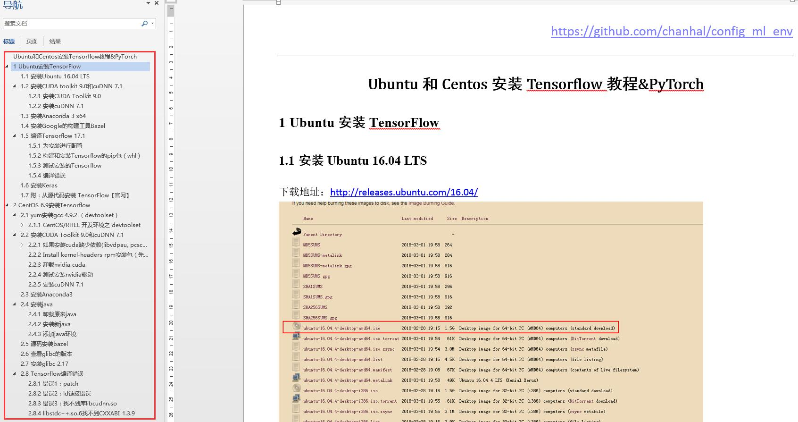

This repo includes a complete tutorial for install PyTorch and Tensorflow in CentOS 6 and Ubuntu 16.04 LTS.

[Note-Ubuntu和CentOS安装Tensorflow&PyTorch.pdf](./pdfs/Note-Ubuntu和CentOS安装Tensorflow&PyTorch.pdf)

In the coming days, a lot of carefully prepared works will be included.
